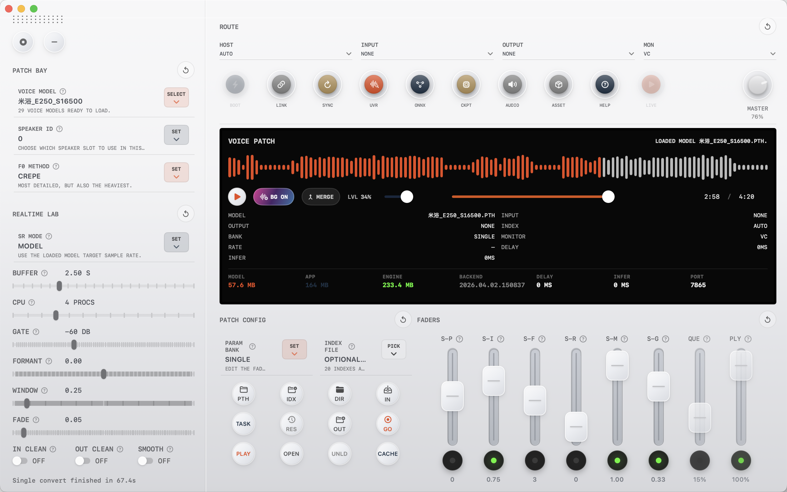
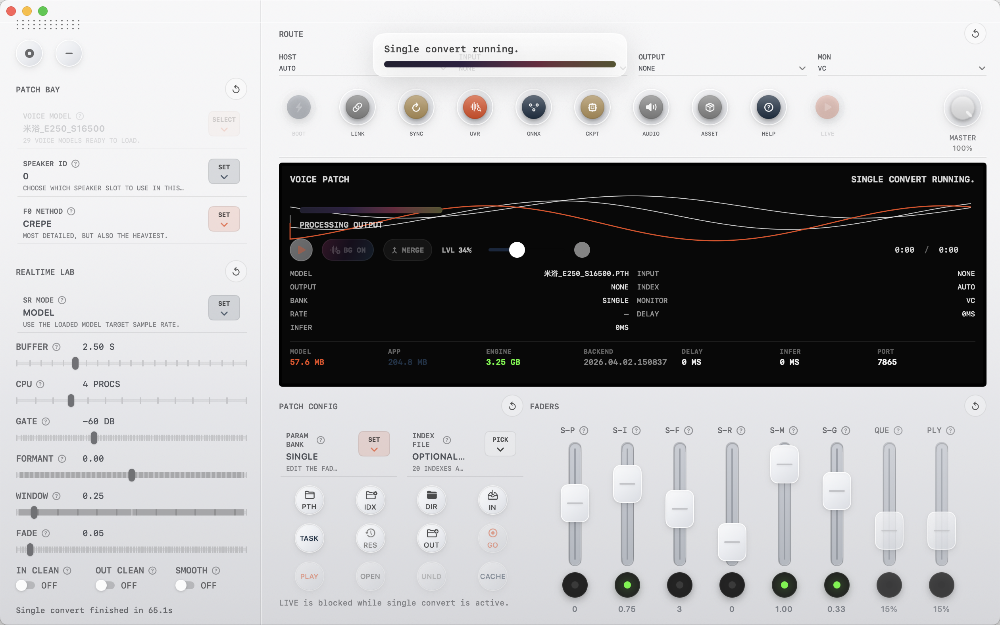
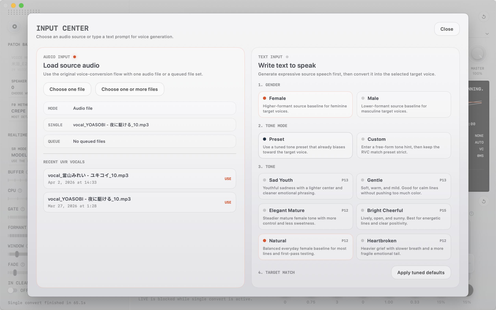
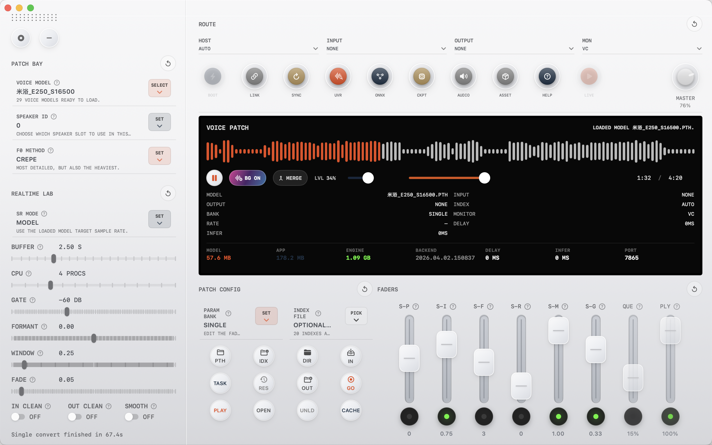
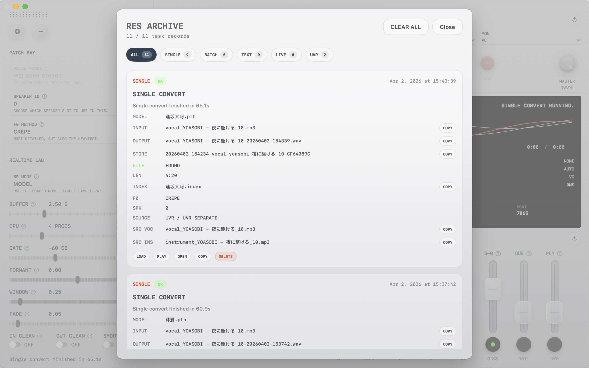
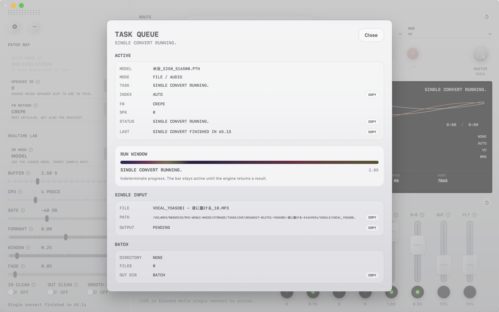

# MACR0VC

MACR0VC 是一个面向 macOS 的 RVC 桌面工作台，把 Swift 客户端和集成式 Python 声音引擎收拢到同一套本地界面里，用于单文件变声、批量任务、实时变声、文本生成目标音色、UVR 分离、任务追踪和结果归档。

[English](../README.md) | **简体中文**

<p>
  <a href="../LICENSE"></a>
  <a href="https://github.com/boogieLing/MACR0VC"></a>
  <a href="https://github.com/boogieLing/MACR0VC/forks"></a>
  
  
  
  
</p>



---

[项目简介](#项目简介) ·
[核心能力](#核心能力) ·
[界面截图](#界面截图) ·
[快速开始](#快速开始) ·
[常用命令](#常用命令) ·
[架构与目录](#架构与目录) ·
[工作流要点](#工作流要点) ·
[贡献方式](#贡献方式) ·
[协议与使用限制](#协议与使用限制) ·
[Star History](#star-history)

## 项目简介

MACR0VC 面向的是需要在一台 macOS 设备上完成完整 RVC 工作流的创作者和操作人员，而不是把多个脚本、分离工具和试听步骤拆开手动拼接。

项目当前由三部分组成：

- `mac-client/`
  Swift 编写的 macOS 桌面客户端
- `engine/`
  Python / FastAPI 声音引擎与实时音频链路
- `dist/SwiftRVCMacClient.app`
  本地打包得到的可运行 `.app` 产物

围绕这些边界，当前已经形成的实际工作流包括：

- 加载音频文件并转换为目标音色
- 队列化批量变声
- 按需启用实时变声
- 输入文本，先生成源语音，再匹配到当前目标音色
- 用 UVR 做人声 / 伴奏分离
- 在 `TASK` 面板里查看当前任务
- 在 `RES` 归档里回看输出、源文件关联和历史记录

## 核心能力

### 变声主流程

- 单文件变声
- 批量变声
- 实时变声
- 文本生成目标音色

### 生产辅助能力

- UVR 人声 / 伴奏分离
- `TASK` 任务队列与运行状态观察
- `RES` 历史结果归档与清理
- 背景声合并与播放复核

### 本地打包与验证

- 打包输出到 `dist/SwiftRVCMacClient.app`
- 基于 `make` 的开发校验和发布校验入口
- 应用摘要、启动和 release gate 的统一命令面

## 界面截图

### 主工作区

主界面把音色补丁、实时控制、离线转换、播放和运行时状态放在同一屏。



### 输入中心

输入面板同时支持直接加载音频文件，以及输入文本后生成语音再进入当前目标音色。



### 转换完成视图

转换结束后，结果可以直接在主界面里试听、复核和继续合并导出。



### RES 归档

`RES` 面板保存历史输出、来源关联、模型上下文和清理操作。



### TASK 队列

`TASK` 面板展示当前任务、运行进度、输入来源和最近状态切换。



## 快速开始

### 环境要求

- macOS 14 或更高版本
- 与 `swift-tools-version: 6.2` 兼容的 Swift 工具链
- `engine/` 对应的本地 Python 环境
- 至少准备一个可用于推理的 RVC `.pth` 音色模型

### 1. 克隆仓库

```bash
git clone git@github.com:boogieLing/MACR0VC.git
cd MACR0VC
git submodule update --init --recursive
```

`engine/` 是以 submodule 形式接入的。如果跳过这一步，本地可能没有完整的后端代码、内置资源和示例模型快照。

### 2. 准备模型与基础推理资源

如果没有模型文件和基础推理资源，MACR0VC 即使能启动也无法真正执行变声。

模型默认位置：

- `engine/assets/weights/`
  至少应包含一个 `.pth` 音色模型
- `engine/assets/indices/`
  可放与模型对应的 `.index` 文件

基础推理资源：

- `engine/assets/hubert/hubert_base.pt`
- `engine/assets/rmvpe/rmvpe.pt`
- `engine/assets/rmvpe/rmvpe.onnx`

当前仓库快照里可能已经带有示例模型和索引；如果你的本地副本没有这些文件，就需要先补上自己的 `.pth` 和可选 `.index`，否则单文件、批量、实时和文本生成目标音色都无法正常工作。

模型识别规则：

- 如果后端看不到有效的 `.pth` 文件，`VOICE MODEL` 会一直停留在 `Choose target voice`
- `.index` 不是强制项，但很多音色会因为索引而更稳定、更像目标角色
- 客户端会优先尝试按文件名自动匹配与模型相近的 `.index`
- `SPEAKER ID` 只对多说话人模型有意义，单说话人模型通常保持 `0`

应用启动后，建议使用：

- `ASSET`
  查看资源完整性，并在基础资源缺失时触发内置下载补齐
- `SYNC`
  在你新增或替换 `.pth` / `.index` 后刷新模型目录

### 3. 查看当前命令入口

```bash
make help
```

### 4. 跑共享开发校验

```bash
make dev-check
```

### 5. 打包应用

```bash
make package
```

预期产物：

```text
dist/SwiftRVCMacClient.app
```

### 6. 查看应用摘要或直接启动

```bash
make app-info
make run-app
```

### 7. 确认应用已经具备可转换状态

第一次启动时，最小可用流程建议按这个顺序确认：

1. 点击 `BOOT` 启动后端
2. 打开 `ASSET`，确认基础推理资源已经就绪
3. 点击 `SYNC`，刷新模型列表
4. 在音色补丁区选择一个目标模型

如果界面里没有出现任何模型，按这个顺序排查：

1. 确认已经执行过 `git submodule update --init --recursive`
2. 检查 `engine/assets/weights/` 中是否真的有 `.pth`
3. 新增文件后再次点击 `SYNC`
4. 如果依然报基础资源缺失，再打开 `ASSET` 排查

### 8. 交付前运行本地 release gate

```bash
make release-check
```

## 常用命令

| 命令 | 作用 |
| --- | --- |
| `make help` | 查看当前命令索引 |
| `make status` | 查看根仓库 git 状态 |
| `make engine-status` | 查看 `engine/` 嵌套仓库状态 |
| `make dev-check` | 执行共享开发校验 |
| `make package` | 构建 `dist/SwiftRVCMacClient.app` 并输出应用摘要 |
| `make app-info` | 输出已打包应用的元数据与体积摘要 |
| `make run-app` | 从 `dist/` 直接启动应用 |
| `make release-check` | 运行本地发布门禁并校验 app bundle |

## 架构与目录

MACR0VC 当前把桌面客户端、Python 引擎和打包工作流分得比较清楚。

```text
MACR0VC/
├── mac-client/   # SwiftPM macOS 客户端
├── engine/       # Python FastAPI 引擎与实时音频链路
├── scripts/      # 打包、校验、版本联动脚本
├── docs/         # 项目与流程文档
├── dist/         # 应用产物与截图
├── Makefile      # 推荐本地命令入口
└── AGENTS.md     # 仓库操作规则
```

### 主要子系统

- `mac-client/`
  负责桌面界面、应用状态、bridge client 和打包资源
- `engine/`
  负责 phase1 FastAPI 后端、实时变声控制器、运行时与音频处理
- `scripts/`
  负责构建、打包、版本同步和 release 校验

## 工作流要点

### 桌面优先

项目核心交付物是本地 macOS 应用，而不是浏览器控制台。默认打包产物为：

```text
dist/SwiftRVCMacClient.app
```

### 实时变声默认按需启用

实时变声被视为显式工作流，不会在应用启动时自动初始化。离线变声和文本生成目标音色仍然是默认可用的主要路径。

### 命令面收敛

当前日常操作已经收口到少量入口：

- `make dev-check`
- `make package`
- `make app-info`
- `make run-app`
- `make release-check`

## 贡献方式

欢迎通过以下方式参与：

- 用 GitHub Issues 提交 bug 或工作流问题
- 通过 Pull Requests 提交代码修改
- 改进文档、打包流程或开发流程
- 对桌面变声流程、实时体验、任务面板提出反馈

提交改动时，建议同时说明：

- 改了什么
- 为什么要改
- 如何验证
- 是否重新打包或跑过 release gate

## 协议与使用限制

本项目当前采用 `PolyForm Noncommercial 1.0.0` 协议。

- 禁止商用
- 完整协议文本位于顶层 [`LICENSE`](../LICENSE)
- 使用、传播和修改都应遵循 `PolyForm Noncommercial 1.0.0` 的限制

由于该协议禁止商用，这份文档不会把项目描述为 OSI 意义下的 open source。

## Star History

[](https://star-history.com/#boogieLing/MACR0VC&Date)
